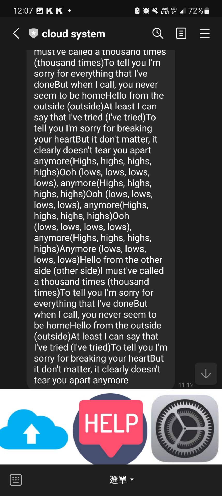

# music line bot
## 建立環境
```python
git clone https://github.com/samwang1228/music-line-bot.git
cd music-line-bot
pip install -r requirements.txt
```
## 修改API KEY
```python
# linebotFunc1.py
line_bot_api = LineBotApi('你的 CHANNEL_ACCESS_TOKEN')
handler = WebhookHandler('你的 CHANNEL_SECRET')
```
## 功能解釋
我們提供以下功能
1. @上傳檔案(也可以點擊左下角icon)將會回傳一個link給你請點擊此link到該網站上傳mp3檔案上船完成後系統會幫你辨識歌曲此外也可以根據曲風或歌詞推薦歌給你
2. @歷史紀錄(也可以點擊右下方icon)我們將會顯示你過往上傳的mp3並讓你可以選擇
3. @以曲風推薦(點擊card button)會推薦曲風相似的歌曲
4. @以歌詞推薦(點擊card button)會推薦歌詞相似的歌曲
5. 提供完整歌詞
## 結果
### 上傳檔案
<table>
  <tr>
    <td>
     </td>
    <td>
     </td>
  </tr>
</table>

 

### 歷史紀錄
<table>
  <tr>
    <td>
    
    <td>
    
  </tr>
</table>

### 推薦相似歌
<table>
  <tr>
    <td>
    
    <td>
    
  </tr>
</table>

### 完整歌詞
<table>
  <tr>
    <td>
    <td>
    
  </tr>
</table>
